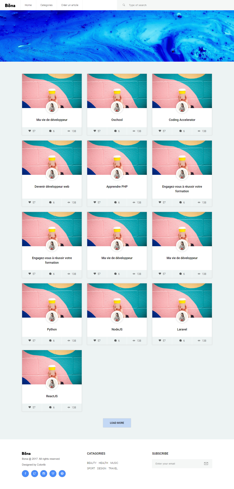

# PHP Blog with MVC architecture

##This repo shows how to create a blog with MVC architecture

## Built With

- PHP 7
- Bootstrap 4

## How to use this repository

- create a local database named "blog_mvc"
- clone the repository in your www folder if you have wamp. If you don't have wamp, clone the repository to the projects folder of your local server environment.
- rendez-vous in the Model.php file located in the models folder and modify the login credentials to the database
- finally, open your browser and go to localhost/blog_mvc

## Authors

👤 **David YAO**

- GitHub: [@daviidy](https://github.com/daviidy)
- Twitter: [@davidyao3](https://twitter.com/DavidYao3)
- LinkedIn: [@daviidy](https://www.linkedin.com/in/david-yao-6bb95299/)
- Personal Website: [@daviidy](http://david-yao.com)

## 🤝 Contributing

Contributions, issues, and feature requests are welcome!

Feel free to check the [issues page](issues/).

## Show your support

Give a ⭐️ if you like this project!
